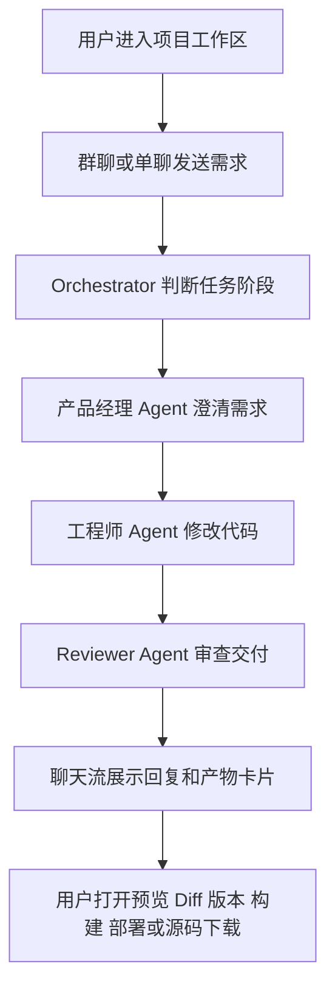
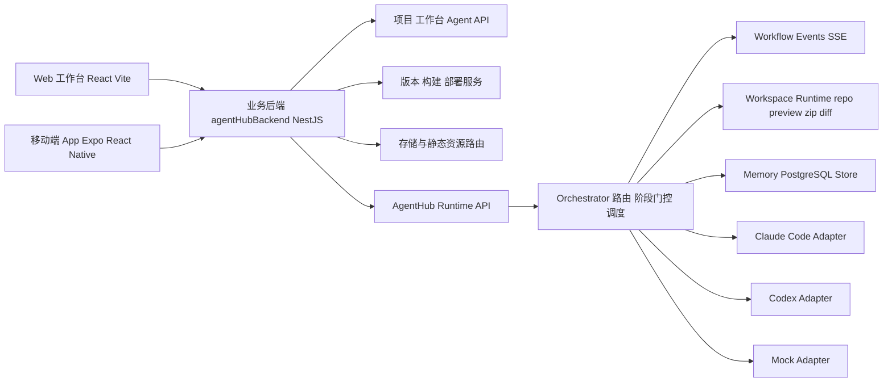
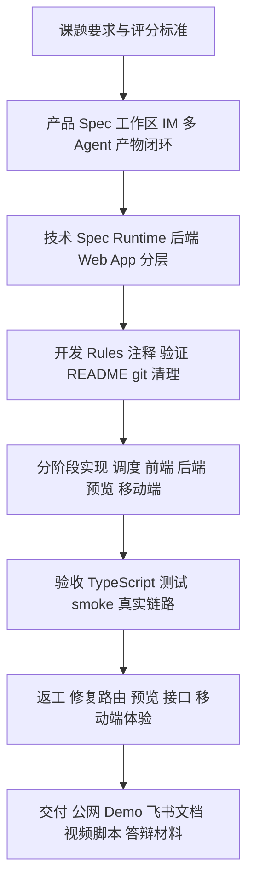

# AgentHub 多 Agent 协作平台

## 1. 项目简介

AgentHub 是一个以 IM 聊天为核心交互的多 Agent 协作平台。用户在项目工作区中像使用飞书/微信一样发起需求、发送消息、@Agent、查看过程和预览产物；平台由 Orchestrator 自动调度产品经理、工程师、审查员等子 Agent，共同完成需求澄清、代码实现、审查、预览、版本和交付。

一句话概括：

> AgentHub 把 AI Agent 从“单个工具回答”升级为“项目工作区中的多 Agent 协作与产物交付”。

公网 Demo：

- Web 工作台：http://120.79.130.49:5173
- 业务后端健康检查：http://120.79.130.49:8790/api/health
- GitHub 仓库：https://github.com/zzz-runnner/byDance

当前后端健康检查返回：

```json
{
  "ok": true,
  "service": "agenthub-backend",
  "agentHubBaseUrl": "http://agenthub:8787",
  "storageRoot": "/app/data"
}
```

### 1.1 飞书页面素材插入位置

> 下面这些方括号内容是给排版时看的。正式提交前可以保留为“图注/附件说明”，也可以在插入对应素材后删除方括号。

| 位置 | 建议插入内容 | 目的 |
| --- | --- | --- |
| 项目简介之后 | [插入 Demo 视频：3-7 分钟，标题建议为“AgentHub 主流程 Demo”。视频覆盖：进入公网 Web 工作台、创建/打开工作区、群聊 @Agent、过程卡片、产物卡片、预览/Diff/版本/构建部署入口、移动端浏览。] | 让评委先看到可运行成果，降低阅读成本 |
| 公网 Demo 地址下方 | [插入截图 1：公网 Web 工作台首页或工作区列表，截图里保留浏览器地址栏 `120.79.130.49:5173`。] | 证明项目已公网可访问 |
| 5.1 IM 核心体验 | [插入截图 2：群聊界面，重点展示 `@Agent`、流式回复、过程卡片、产物卡片。] | 对应 IM、多会话、上下文和过程可视化 |
| 5.2 多 Agent 调度 | [插入截图 3：Orchestrator/Agent 过程事件，展示产品经理、工程师、Reviewer 或 handoff/run 状态。] | 对应多 Agent 协调和主 Agent 调度 |
| 5.3 产物预览与交付 | [插入截图 4：代码工作区，展示文件树、Diff、Preview、Version、Build/Deploy 或源码 zip 入口。] | 对应产物闭环和工程交付能力 |
| 5.3 产物预览与交付 | [可选截图 5：PDF/DOCX/PPTX 文档预览。] | 加强生成效果质量和产物类型丰富度 |
| 5.4 多端支持 | [插入截图 6：移动端首页、工作区、聊天、产物摘要、构建/部署状态入口拼图。] | 证明 App 不是口头补充，而是有真实界面 |
| 8. AI 协作开发记录 | [插入截图 7：Codex 协作过程截图，建议选“移动端取舍、文档交付冲刺、图表修正、Skills 口径修正”等关键对话片段。注意遮挡无关隐私信息。] | 对应评分中 AI 协作能力 |
| 文末附件区 | [附件：GitHub 仓库链接、公网 Demo 地址、源码 zip 或仓库 release、Demo 视频文件/网盘链接；核心文档见下方“核心证据可点击链接表”。] | 给评委进一步核验的证据入口 |

建议飞书正文顶部保留一个“快速入口”小表：

| 类型 | 地址/材料 |
| --- | --- |
| Web Demo | http://120.79.130.49:5173 |
| 后端健康检查 | http://120.79.130.49:8790/api/health |
| GitHub | https://github.com/zzz-runnner/byDance |
| Demo 视频 | [插入视频或网盘链接] |
| 核心附件 | [插入附件区链接或飞书附件] |

核心证据建议使用可点击链接，不要只写文件路径：

| 材料 | 点击链接 | 用途 |
| --- | --- | --- |
| 飞书交付终稿 | [GitHub 直达](https://github.com/zzz-runnner/byDance/blob/zoe/docs/delivery-90/%E9%A3%9E%E4%B9%A6%E4%BA%A4%E4%BB%98%E7%BB%88%E7%A8%BF.md) | 评委正文备份 |
| AI 协作规范与 Skills 沉淀 | [GitHub 直达](https://github.com/zzz-runnner/byDance/blob/zoe/docs/AI%E5%8D%8F%E4%BD%9C%E8%A7%84%E8%8C%83%E4%B8%8ESkills%E6%B2%89%E6%B7%80.md) | AI 协作能力证据 |
| 架构设计文档 | [GitHub 直达](https://github.com/zzz-runnner/byDance/blob/zoe/docs/AgentHub%E6%9E%B6%E6%9E%84%E8%AE%BE%E8%AE%A1%E6%96%87%E6%A1%A3.md) | 产品和技术架构 Spec |
| 技术方案及技术栈 | [GitHub 直达](https://github.com/zzz-runnner/byDance/blob/zoe/docs/%E5%BC%80%E5%8F%91%E5%85%B7%E4%BD%93%E6%96%B9%E6%A1%88%E5%8F%8A%E6%8A%80%E6%9C%AF%E6%A0%88.md) | 工程拆分和技术方案 |
| 业务后端接口文档 | [GitHub 直达](https://github.com/zzz-runnner/byDance/blob/zoe/docs/%E4%B8%9A%E5%8A%A1%E5%90%8E%E7%AB%AF%E6%8E%A5%E5%8F%A3%E6%96%87%E6%A1%A3.md) | 后端 API 和字段约定 |
| 真实链路验收与返工机制 | [GitHub 直达](https://github.com/zzz-runnner/byDance/blob/zoe/docs/AgentHub%E7%9C%9F%E5%AE%9E%E9%93%BE%E8%B7%AF%E9%AA%8C%E6%94%B6%E4%B8%8E%E8%BF%94%E5%B7%A5%E6%9C%BA%E5%88%B6%E6%94%B9%E9%80%A0%E6%96%B9%E6%A1%88.md) | Agent 链路验收和自动返工证据 |
| 开发协作 rules | [GitHub 直达](https://github.com/zzz-runnner/byDance/blob/zoe/docs/developSkills.md) | AI 协作规则证据 |
| 移动端功能取舍说明 | [GitHub 直达](https://github.com/zzz-runnner/byDance/blob/zoe/agentHubApp/docs/AgentHub%E7%A7%BB%E5%8A%A8%E7%AB%AFApp%E5%8A%9F%E8%83%BD%E5%8F%96%E8%88%8D%E8%AF%B4%E6%98%8E.md) | App 职责边界证据 |
| 移动端接口对接文档 | [GitHub 直达](https://github.com/zzz-runnner/byDance/blob/zoe/agentHubApp/docs/AgentHub%E7%A7%BB%E5%8A%A8%E7%AB%AFApp%E6%8E%A5%E5%8F%A3%E5%AF%B9%E6%8E%A5%E6%96%87%E6%A1%A3.md) | App API 接入证据 |
| Web 工作台 README | [GitHub 直达](https://github.com/zzz-runnner/byDance/blob/zoe/agentHubFrontend/README.md) | Web 功能与运行说明 |
| 业务后端 README | [GitHub 直达](https://github.com/zzz-runnner/byDance/blob/zoe/agentHubBackend/README.md) | 后端能力与运行说明 |

> 注意：上表链接基于 GitHub `zoe` 分支。新增文档提交并推送到 GitHub 后，链接才会对评委真正可访问。若最终提交分支不是 `zoe`，需要把链接中的 `/blob/zoe/` 改成最终分支名。

## 2. 课题要求理解

课题要求构建一个简化实战版的多 Agent 协作平台，核心是：

- 以 IM 聊天作为主要交互范式。
- 支持新建对话、多会话并行、群聊协作。
- 在群聊中由 Orchestrator 协调多个 Agent。
- 支持上下文连续和多轮迭代修改。
- Agent 输出不仅是文字，还要能内联展示 Diff、网页预览、文件附件等产物。
- 接入主流 Agent 平台，并支持用户自建 Agent。
- 支持实时预览、代码二次编辑和一键部署发布。

我们对题目的理解是：评分重点不只是“做一个聊天 UI”，而是要证明平台具备完整的 AI 协作能力、Agent 调度能力和产物交付能力。因此 AgentHub 的设计围绕“工作区 + IM + 多 Agent + 产物闭环”展开。

## 3. 产品定位

### 3.1 目标用户

AgentHub 面向希望通过对话快速生成网页、Workflow、文档或代码产物的用户。用户不需要理解 Claude Code、Codex 等底层 Agent 工具的差异，只需要在一个工作区里发起需求，平台会组织不同 Agent 完成任务。

### 3.2 核心产品概念

1. 工作区  
   一个工作区对应一个项目，保存项目目标、聊天历史、Agent 成员、代码仓库、任务记录、产物和版本状态。

2. 群聊  
   群聊是项目主协作现场。用户可以在群聊中描述需求、@Agent、查看执行过程和接收最终产物。

3. 单聊  
   单聊用于用户和单个 Agent 的定向沟通，例如单独问产品经理澄清需求，或让工程师检查某个文件。

4. Orchestrator  
   Orchestrator 是主 Agent，负责理解用户意图、判断任务阶段、选择子 Agent、组织执行顺序，并在需要时汇总结果。

5. 子 Agent  
   当前核心子 Agent 包括产品经理 Agent、工程师 Agent、审查 Agent。平台还支持工作区级自建 Agent。

6. 产物卡片  
   Agent 的输出会沉淀为可操作产物，例如网页预览、Diff、文件、文档、zip、构建和部署结果。

## 4. 核心流程



上图展示主线流程。实际系统还有两个关键分支：

| 分支 | 系统行为 | 设计价值 |
| --- | --- | --- |
| 需求尚未确认 | Orchestrator 只派产品经理 Agent 澄清需求，不直接让工程师写代码 | 避免 AI 过早实现，保证范围和验收标准先明确 |
| 审查未通过或部分通过 | 触发一次自动返工，或明确告诉用户当前风险 | 避免把半成品包装成完成，同时避免无限返工 |

这个流程体现了两个关键设计：

- 模糊需求不会直接进入工程实现，先由产品经理 Agent 澄清。
- 工程产物不是只看 Agent 是否有输出，而是经过交付校验和 Reviewer 审查。

## 5. 功能完成情况

### 5.1 IM 核心体验

已实现：

- 工作区列表。
- 工作区搜索、筛选、排序、置顶、归档。
- 群聊和单聊。
- `@Agent` 显式指定。
- 消息引用。
- 消息 pin 作为长期上下文。
- SSE 流式回复和过程事件。
- Agent 过程卡片。
- 产物卡片。
- Markdown 渲染、代码块和复制。

对应课题要求：

- 新建对话。
- 多会话并行。
- 群聊协作。
- 上下文连续。
- 消息操作和产物内联。

### 5.2 多 Agent 调度

已实现：

- Orchestrator 自动判断任务阶段。
- 显式 `@Agent` 时锁定为单 Agent 执行和可见回复。
- 非显式场景可根据任务类型选择可见子 Agent。
- 产品经理、工程师、审查员串行协作。
- 工程任务自动补 reviewer。
- 文件写入类并行任务会降级串行，避免代码冲突。
- 子 Agent 通过 `TaskHandoff` 和 `AgentRun` 记录执行过程。
- 支持 Claude Code、Codex、mock 适配器。
- 支持工作区级自建 Agent。

对应课题要求：

- 主 Agent 协调器。
- 多 Agent 调度。
- 至少接入两个主流 Agent 平台。
- 支持用户自建 Agent。

### 5.3 产物预览与交付

已实现：

- 网页预览。
- 文件树和源码查看。
- Diff 查看。
- 文档预览：PDF、DOCX、PPTX。
- 源码 zip 下载。
- 保存版本。
- 版本列表。
- 版本 Diff。
- 版本恢复。
- 服务端构建预览。
- 部署预览与源码打包下载。

对应课题要求：

- Agent 回复中内联产物预览卡片。
- 点击卡片展开预览/代码编辑器。
- Diff 视图。
- 版本历史。
- 部署和源码打包下载。

### 5.4 多端支持

Web 端是完整工作台，覆盖聊天、Agent 管理、代码、Diff、预览、版本、构建和部署。

移动端是轻量协作入口，覆盖：

- 首页概览。
- 工作区列表。
- 群聊/单聊。
- 产物摘要。
- Agent 列表。
- Markdown 聊天渲染。

移动端不复制完整 Web 工程工作台，重点承担查看、跟进和轻量协作。App 中可以保留构建、部署、产物等相关入口或状态展示，用于快速触达工作区结果；完整日志排查、复杂 Diff 阅读和 Monaco 级代码编辑仍以 Web 工作台为主。

## 6. 技术架构



四个工程职责：

| 目录 | 职责 |
| --- | --- |
| `agentHub` | 多 Agent runtime，负责 Orchestrator、子 Agent 调度、Adapter、workflow events、workspace repo、preview、zip 和存储 |
| `agentHubBackend` | 业务后端，负责项目元数据、工作台接口、版本、构建、部署预览、预览代理和统一 API |
| `agentHubFrontend` | Web 工作台，负责工作区、聊天、过程卡片、产物卡片、代码工作区、Diff、预览、版本和交付 |
| `agentHubApp` | 移动端 App，负责轻量工作区、聊天、产物摘要和 Agent 状态查看 |

## 7. 关键技术设计

### 7.1 工作区作为上下文容器

工作区保存项目目标、聊天历史、Agent 成员、repo、产物和版本状态。这样群聊和单聊都围绕同一个项目上下文展开，不同项目之间上下文隔离。

### 7.2 Orchestrator 阶段门控

系统把用户请求划分为普通聊天、需求澄清、方案规划、等待确认、执行、审查等阶段。需求或规划阶段不允许工程师直接写代码，必须先完成澄清和确认。

### 7.3 Adapter 层

Claude Code、Codex、mock 的调用方式不同。AgentHub 使用统一 Adapter 层，让上层只关心 AgentDefinition、TaskHandoff 和 AgentRun，屏蔽底层工具差异。

### 7.4 SSE 过程事件流

Agent 执行是长耗时任务，普通 HTTP 不适合展示过程。平台使用 SSE 返回 routing、handoff、agent run、validation、review、preview、assistant delta 等事件，前端实时渲染过程卡片。

### 7.5 交付校验和自动返工

工程 Agent 有输出不代表真正完成。系统会结合进程状态、文件变化、交付校验和 reviewer verdict 判断结果是 success、partial 还是 failed。未通过时可以触发一次自动返工，避免把半成品包装成完成。

## 8. AI 协作开发记录

本项目开发过程沉淀了 Spec、rules 和专项协作记录，对应评分中的 AI 协作能力。

### 8.1 Spec

可作为 Spec 的文档：

| 文档 | 用途 |
| --- | --- |
| [架构设计文档](https://github.com/zzz-runnner/byDance/blob/zoe/docs/AgentHub%E6%9E%B6%E6%9E%84%E8%AE%BE%E8%AE%A1%E6%96%87%E6%A1%A3.md) | 产品形态、工作区、群聊、单聊、Orchestrator、AgentDefinition、Artifact、架构边界 |
| [开发具体方案及技术栈](https://github.com/zzz-runnner/byDance/blob/zoe/docs/%E5%BC%80%E5%8F%91%E5%85%B7%E4%BD%93%E6%96%B9%E6%A1%88%E5%8F%8A%E6%8A%80%E6%9C%AF%E6%A0%88.md) | 前后端分离、runtime workspace、业务后端存储、版本、构建、部署方案 |
| [第一期落地执行计划](https://github.com/zzz-runnner/byDance/blob/zoe/docs/AgentHub%E7%AC%AC%E4%B8%80%E6%9C%9F%E8%90%BD%E5%9C%B0%E6%89%A7%E8%A1%8C%E8%AE%A1%E5%88%92.md) | 第一阶段落地范围、优先级、P2 边界 |
| [本地最小产物闭环分批实施方案](https://github.com/zzz-runnner/byDance/blob/zoe/docs/AgentHub%E6%9C%AC%E5%9C%B0%E6%9C%80%E5%B0%8F%E4%BA%A7%E7%89%A9%E9%97%AD%E7%8E%AF%E5%88%86%E6%89%B9%E5%AE%9E%E6%96%BD%E6%96%B9%E6%A1%88.md) | 本地闭环、工作台、后端、runtime 的职责边界 |
| [业务后端接口文档](https://github.com/zzz-runnner/byDance/blob/zoe/docs/%E4%B8%9A%E5%8A%A1%E5%90%8E%E7%AB%AF%E6%8E%A5%E5%8F%A3%E6%96%87%E6%A1%A3.md) | 已实现业务后端接口和字段约定 |

### 8.2 Rules

可作为 rules 的文档：

| 文档 | 用途 |
| --- | --- |
| [项目协作 rules](https://github.com/zzz-runnner/byDance/blob/zoe/docs/developSkills.md) | 项目协作规范：注释、验证、临时文件清理、README 更新、git 管理 |
| [Runtime 侧开发 rules](https://github.com/zzz-runnner/byDance/blob/zoe/agentHub/developSkills.md) | Runtime 侧开发规则 |
| [Web 端开发 rules](https://github.com/zzz-runnner/byDance/blob/zoe/agentHubFrontend/developSkills.md) | Web 端开发规则 |

核心规则包括：

- 新增或修改代码要有清晰职责边界。
- 函数注释说明作用、输入和输出。
- 修改后在条件允许时执行验证命令。
- 临时测试文件和日志要清理。
- 阶段性完成后更新 README。
- git 提交使用中文详细说明，不随意推送远程。

### 8.3 Skills / 专项能力沉淀

本项目把 AI 协作中的专项方法沉淀为仓库内文档：[AI 协作规范与 Skills 沉淀](https://github.com/zzz-runnner/byDance/blob/zoe/docs/AI%E5%8D%8F%E4%BD%9C%E8%A7%84%E8%8C%83%E4%B8%8ESkills%E6%B2%89%E6%B7%80.md)。这样交付证据不依赖某台电脑上的个人 Codex 路径，而是可以跟随 GitHub 仓库一起提交。

这里的 skills 分为 Agent Runtime、Web 工作台、业务后端、移动端四类。

#### 8.3.1 Agent Runtime 专项能力

| 专项文档/代码 | 对应能力 |
| --- | --- |
| [真实链路验收与返工机制](https://github.com/zzz-runnner/byDance/blob/zoe/docs/AgentHub%E7%9C%9F%E5%AE%9E%E9%93%BE%E8%B7%AF%E9%AA%8C%E6%94%B6%E4%B8%8E%E8%BF%94%E5%B7%A5%E6%9C%BA%E5%88%B6%E6%94%B9%E9%80%A0%E6%96%B9%E6%A1%88.md) | 真实 Agent 链路验收、交付状态、reviewer verdict、自动返工 |
| [workflow.ts](https://github.com/zzz-runnner/byDance/blob/zoe/agentHub/src/server/orchestrator/workflow.ts) | 多 Agent 主流程、阶段门控、调度、SSE 事件和结果汇总 |
| [delivery 模块](https://github.com/zzz-runnner/byDance/tree/zoe/agentHub/src/server/orchestrator/delivery) | 交付校验、状态判定和 reviewer 证据 |
| [adapters 模块](https://github.com/zzz-runnner/byDance/tree/zoe/agentHub/src/server/adapters) | Claude Code、Codex、mock 适配器能力 |
| [真实链路测试](https://github.com/zzz-runnner/byDance/blob/zoe/agentHub/tests/real/agent-chain-probe.test.ts) | 真实 Agent 链路验证能力 |

#### 8.3.2 Web 工作台专项能力

| 专项文档/代码 | 对应能力 |
| --- | --- |
| [Web 端已有功能清单](https://github.com/zzz-runnner/byDance/blob/zoe/agentHubApp/docs/AgentHub%20Web%E7%AB%AF%E5%B7%B2%E6%9C%89%E5%8A%9F%E8%83%BD%E6%B8%85%E5%8D%95.md) | Web 已有功能盘点，可证明工作台能力完整 |
| [Web 工作台 README](https://github.com/zzz-runnner/byDance/blob/zoe/agentHubFrontend/README.md) | Web 当前状态、后端连接、UI 能力和验证命令 |
| [ChatPane.tsx](https://github.com/zzz-runnner/byDance/blob/zoe/agentHubFrontend/src/components/ChatPane.tsx) | 聊天流、@Agent、引用、过程卡片、产物卡片 |
| [CodeWorkspaceDialog.tsx](https://github.com/zzz-runnner/byDance/blob/zoe/agentHubFrontend/src/components/CodeWorkspaceDialog.tsx) | 文件树、源码、Diff、预览、版本、构建、部署入口 |
| [DocumentPreviewPane.tsx](https://github.com/zzz-runnner/byDance/blob/zoe/agentHubFrontend/src/components/DocumentPreviewPane.tsx) | PDF/DOCX/PPTX 文档预览 |

#### 8.3.3 业务后端专项能力

| 专项文档/代码 | 对应能力 |
| --- | --- |
| [业务后端接口文档](https://github.com/zzz-runnner/byDance/blob/zoe/docs/%E4%B8%9A%E5%8A%A1%E5%90%8E%E7%AB%AF%E6%8E%A5%E5%8F%A3%E6%96%87%E6%A1%A3.md) | 已实现接口、字段、错误约定和 SSE/静态资源约定 |
| [业务后端 README](https://github.com/zzz-runnner/byDance/blob/zoe/agentHubBackend/README.md) | 业务后端职责、预览链路、主要 API、当前边界 |
| [projects 模块](https://github.com/zzz-runnner/byDance/tree/zoe/agentHubBackend/src/projects) | 项目、工作区绑定、状态聚合 |
| [versions 模块](https://github.com/zzz-runnner/byDance/tree/zoe/agentHubBackend/src/versions) | 版本保存、列表、Diff、恢复 |
| [builds 模块](https://github.com/zzz-runnner/byDance/tree/zoe/agentHubBackend/src/builds) | 服务端构建和 build preview |
| [deployments 模块](https://github.com/zzz-runnner/byDance/tree/zoe/agentHubBackend/src/deployments) | 后端静态部署预览 |

#### 8.3.4 移动端专项能力

| 专项文档/代码 | 对应能力 |
| --- | --- |
| [移动端 App 功能取舍说明](https://github.com/zzz-runnner/byDance/blob/zoe/agentHubApp/docs/AgentHub%E7%A7%BB%E5%8A%A8%E7%AB%AFApp%E5%8A%9F%E8%83%BD%E5%8F%96%E8%88%8D%E8%AF%B4%E6%98%8E.md) | 移动端产品取舍和职责边界 |
| [移动端 App 接口对接文档](https://github.com/zzz-runnner/byDance/blob/zoe/agentHubApp/docs/AgentHub%E7%A7%BB%E5%8A%A8%E7%AB%AFApp%E6%8E%A5%E5%8F%A3%E5%AF%B9%E6%8E%A5%E6%96%87%E6%A1%A3.md) | 移动端接口接入规范 |
| [移动端 UI 功能说明](https://github.com/zzz-runnner/byDance/blob/zoe/agentHubApp/docs/AgentHub%E7%A7%BB%E5%8A%A8%E7%AB%AFUI%E5%8A%9F%E8%83%BD%E8%AF%B4%E6%98%8E.md) | 移动端 UI 功能说明 |
| [移动端 README](https://github.com/zzz-runnner/byDance/blob/zoe/agentHubApp/README.md) | 移动端当前范围、命令和不做项 |

### 8.4 协作过程

实际 AI 协作流程：



### 8.5 关键提交记录

近期提交能证明项目持续迭代：

| 提交 | 内容 |
| --- | --- |
| `f303835` | 锁定群聊显式 @agent 为单 Agent 执行与回复 |
| `fffdb8d` | 修复新建 Agent 弹窗创建态闪退并补充真实链路验证记录 |
| `5bd726e` | 部署 agenthub backend with runtime workspaces |
| `207e221` | Add workspace deletion flow across runtime and web |
| `3a49289` | Stabilize streaming chat and simplify web agent entry |
| `d39929e` | Sync agent API docs with workspace runtime behavior |
| `22f6818` | Connect mobile app to business APIs |
| `6254662` | Render mobile chat markdown |
| `6b250b0` | Add document fallback for workspace preview |
| `75076f0` | Improve app workspace list interactions |

### 8.6 个人 Codex 协作案例

下面这部分可以直接放在飞书正文中，用来补强“AI 协作能力”。本节按成员姓名整理个人 Codex 协作案例，统一从“问题”“AI 协作方式”“产出与效果”三个维度呈现，证据以仓库文档、代码模块和 Git 提交记录为准。

| 案例 | 问题 | AI 协作方式 | 产出与效果 |
| --- | --- | --- | --- |
| 周晓琳｜移动端 App 产品取舍与适配 | Web 工作台能力完整，但移动端屏幕尺寸和交互方式不同，不能直接照搬完整工程工作台。 | 使用 Codex 对照 App README、移动端文档和 Web 功能清单，梳理“小屏轻量协作”和“完整工程工作台”的职责边界。 | 形成 [移动端功能取舍说明](https://github.com/zzz-runnner/byDance/blob/zoe/agentHubApp/docs/AgentHub%E7%A7%BB%E5%8A%A8%E7%AB%AFApp%E5%8A%9F%E8%83%BD%E5%8F%96%E8%88%8D%E8%AF%B4%E6%98%8E.md)、[移动端接口对接文档](https://github.com/zzz-runnner/byDance/blob/zoe/agentHubApp/docs/AgentHub%E7%A7%BB%E5%8A%A8%E7%AB%AFApp%E6%8E%A5%E5%8F%A3%E5%AF%B9%E6%8E%A5%E6%96%87%E6%A1%A3.md) 和 [AI 协作规范与 Skills 沉淀](https://github.com/zzz-runnner/byDance/blob/zoe/docs/AI%E5%8D%8F%E4%BD%9C%E8%A7%84%E8%8C%83%E4%B8%8ESkills%E6%B2%89%E6%B7%80.md)，明确 App 负责查看/触达构建部署和产物状态，复杂 Diff 和代码编辑仍以 Web 为主。 |
| 周晓琳｜移动端 App 主流程与真实数据接入 | 移动端最初需要建立可演示的产品骨架，但如果只停留在 mock 数据，无法证明 App 与 AgentHub 后端真正打通。 | 使用 Codex 将 Web 工作台能力拆成移动端可承载的信息层级，完成 Expo/React Native 项目骨架、工作区主流程和业务 API 封装，并把页面从 mock 展示逐步切换到真实接口数据。 | 形成首页、工作区列表、工作区切换、聊天入口、Agent 列表、产物摘要等移动端主流程；新增 `agentHubApp/src/api/businessBackend.ts`，打通移动端到公网/本地业务后端的连接。对应提交：`a409671`、`741685d`、`70094ac`、`0c3c6dd`、`22f6818`。 |
| 周晓琳｜移动端协作体验与多屏适配打磨 | 移动端需要展示 AI 聊天、Markdown 回复、Agent 状态、产物摘要和构建/部署结果入口，同时兼顾 Android 小屏、iPhone 标准屏和较宽设备。 | 使用 Codex 持续拆分聊天流、Agent 配置、产物详情和工作区列表状态，并按 React Native/Expo 适配方式抽象移动端密度参数，围绕 SafeArea、标题层级、卡片间距和底部导航做多轮调整。 | 完成移动端聊天 Markdown 渲染、Agent 配置入口、Agent 与产物卡片、工作区列表交互、调试弹窗清理和 `mobileScale.ts` 多屏密度优化，让 App 在不同设备上保持可读、可点、可演示。对应提交：`61b8649`、`8463137`、`c7feaeb`、`bb50568`、`6254662`、`673ec8e`、`75076f0`、`7eccbc2`、`ddcdeb0`、`662b661`、`7c638c2`、`7897e08`。 |
| 钟振浩｜工作区级 Agent 成员体系与项目经理 Agent 产品化 | 默认 Agent 与自定义 Agent 需要按工作区独立管理，原有 Agent 名称与标识耦合也不利于后续展示和改名。 | 使用 Codex 梳理 Runtime、业务后端和 Web 工作台三侧的数据结构与调用链，逐步拆分 Agent 名称与标识、接通项目侧 Agent 管理接口，并核对成员状态在聊天、管理弹窗和存储层的一致性。 | 完成工作区级 Agent 成员体系，打通项目侧 Agent 管理链路，支持 Agent 名称与 id 分离，并将内置协调 Agent 产品化为“项目经理 Agent”，同时补齐头像与展示链路。对应提交：`845e1ad`、`98d2009`、`fa81aa9`。 |
| 钟振浩｜文档预览、结果页与产物查看链路收口 | 工作区代码弹窗和结果页存在首文件加载异常、无预览场景展示不一致、产物打开态不稳定等问题，且服务端预览依赖不适合部署环境。 | 使用 Codex 逐段核对文件树、产物入口、预览类型分发和前端渲染链路，先定位首文件加载和结果页状态问题，再将 DOCX、PPTX、PDF 预览能力收口为纯前端方案，并补齐无预览场景的兜底展示。 | 工作区结果页、代码弹窗和产物查看链路更加一致，文档预览不再依赖额外服务端转换环境，能够稳定处理首文件加载、无预览和打开异常场景。对应提交：`56871d8`、`74cd684`、`183d915`、`7aa450a`。 |
| 钟振浩｜显式 @agent 单 Agent 执行与新建 Agent 稳定性修复 | 群聊里用户明确 `@工程师` 时，主脑仍可能接管回复；同时新建自定义 Agent 弹窗在创建态存在闪退，影响工作区自定义成员扩展。 | 使用 Codex 排查 routing、planner、workflow 的 speaker 选择逻辑，以及弹窗创建完成后的状态切换、列表刷新和选中逻辑，并在修复后补充真实链路验证记录。 | 实现显式 `@agent` 后由被 @ 的 Agent 单独执行和回复，保证协作语义准确；同时修复新建 Agent 弹窗闪退问题，提升工作区自定义 Agent 管理稳定性。对应提交：`f303835`、`fffdb8d`。 |
| 杨富林｜Agent 管理与工作区元数据 API 打通 | 工作区需要承载 Agent 成员、项目元数据和状态聚合，但早期后端接口与存储能力不足，前后端缺少统一的 Agent 管理和元数据接口。 | 使用 Codex 梳理 Runtime、业务后端和 Web 工作台之间的字段契约，补齐元数据存储、Agent 管理接口和项目侧状态桥接，并同步修正文档口径。 | 补齐工作区元数据存储与 Agent 管理 API，支撑工作区 Agent 管理弹窗、项目状态聚合和前后端字段对齐。对应提交：`045b532`、`3f017e2`、`d39929e`。 |
| 杨富林｜Runtime / 工作区链路稳定性与状态修复 | 联调后暴露出工作区 Agent 绑定、运行时 CLI、工作区删除、turn 恢复、排序和预览资源地址等一系列链路稳定性问题。 | 使用 Codex 沿着 Runtime、业务后端和 Web 端调用链逐段定位断点，针对工作区绑定、状态恢复、排序和资源地址生成问题做定点修复，并通过联调回归校验前后端行为一致。 | 收口工作区删除、turn recovery、workspace pin 排序、preview asset URL 和流式聊天稳定性等关键问题，提升 Runtime 与工作区整体链路稳定性。对应提交：`c638c78`、`207e221`、`25818d5`、`53cdf3b`、`98aeaea`、`3a49289`。 |
| 杨富林｜部署链路与运行环境收口 | 后端从本地联调推进到可演示的公网运行环境时，需要补齐 Docker 化部署、构建依赖版本、权限问题和部署文档。 | 使用 Codex 逐步整理容器构建脚本、运行时环境变量、依赖版本和部署说明，并根据构建报错和服务器实际表现修复文件权限与运行参数问题。 | 完成 AgentHub 后端的 Docker 化部署链路和部署文档收口，解决构建文件权限、pnpm 版本与运行环境问题，为公网 Demo 和比赛演示提供可复现的部署基础。对应提交：`5bd726e`、`b997b3e`、`fd5f22f`、`dad3651`、`a607076`。 |

## 9. 验收与验证

项目有自动化测试、构建验证和真实链路 smoke 记录。

常用验证命令：

```bash
cd agentHub
npm run check
npm test

cd agentHubBackend
npm run check
npm run build

cd agentHubFrontend
npm run check
npm run build

cd agentHubApp
npm run check
```

真实 Agent 链路测试默认需要显式开启，避免日常测试消耗真实模型或 CLI：

```bash
cd agentHub
$env:AGENTHUB_RUN_REAL_TESTS='true'
npm run test:real
```

已有测试覆盖：

- SSE 流式消息。
- workflow events。
- direct run。
- automatic repair。
- preview route。
- zip route。
- delivery validator。
- dynamic speaker。
- visible speaker。
- runtime workspace。
- real agent chain probe。

## 10. 评分维度对应

| 评分维度 | 权重 | 对应成果 |
| --- | ---: | --- |
| AI 协作能力 | 30% | 已沉淀产品 Spec、技术 Spec、开发 rules、真实链路验收、自动返工机制、移动端取舍规范和 git 记录 |
| 功能完整度 | 25% | 工作区、群聊/单聊、@Agent、Orchestrator 调度、自建 Agent、SSE 流式过程、预览、Diff、版本、构建、部署、zip |
| 生成效果质量 | 20% | Web 工作台、过程卡片、产物卡片、Markdown、网页预览、文档预览、代码工作区、移动端 UI |
| 代码理解度 | 15% | runtime、业务后端、Web、App 分层清晰；可解释路由、Adapter、Context、Workflow Events、Delivery Validation |
| 创新与产品感 | 10% | 工作区式多 Agent IM、自动 reviewer、交付校验、自动返工、文档预览、移动端轻量入口 |

## 11. 当前边界与后续规划

当前版本已经完成比赛核心链路，但仍是比赛 Demo 和 MVP 阶段，不主张已经具备完整生产 SaaS 能力。

当前边界：

- 暂未实现完整多用户账号和权限系统。
- 云端部署已完成公网 Demo，但高可用、多租户、弹性队列仍属于后续扩展。
- 移动端以轻量协作为主，可展示或触达构建、部署、产物等入口；完整工程排查、复杂 Diff 和 Monaco 级代码编辑仍以 Web 工作台为主。
- 更广框架矩阵和复杂发布审批属于后续功能。

后续规划：

- 完善多用户权限和项目协作。
- 扩展云端发布渠道和发布历史。
- 接入更多 Agent 平台和插件生态。
- 增强移动端审批和通知。
- 扩展更多前端框架和工作区模板。

## 12. 总结

AgentHub 已经覆盖课题要求的核心能力：IM 交互、多 Agent 调度、上下文连续、产物内联预览、代码编辑、版本交付和公网可运行 Demo。同时，项目开发过程沉淀了 Spec、rules、专项协作文档、真实链路验收和自动返工机制，能够支撑评分中最重要的 AI 协作能力维度。

相比普通聊天 Demo，AgentHub 的价值在于把 AI 协作做成了一个可观察、可审查、可预览、可交付的项目工作台。
